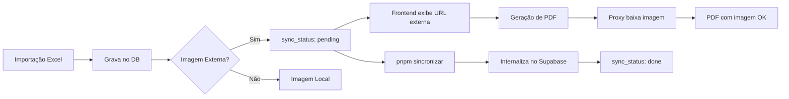

# 📄 Sistema de Proxy de Imagens para Geração de PDF

## 🎯 Problema Resolvido

URLs externas (como da Safilo) causam **erro de CORS** ao gerar PDFs no navegador, resultando em imagens quebradas mesmo que apareçam corretamente na tela.

## ✅ Solução Implementada

### 1. Proxy de Imagens (`/api/image-proxy`)

**Arquivo:** [src/app/api/image-proxy/route.ts](../src/app/api/image-proxy/route.ts)

- Baixa imagens externas **no servidor** (onde não há CORS)
- Protege contra SSRF (Server-Side Request Forgery)
- Implementa timeout de 30s
- Força IPv4 para evitar problemas de DNS
- Usa allowlist de hosts confiáveis

### 2. Geração de PDF Adaptada

**Arquivo:** [src/utils/generateCatalogPDF.ts](../src/utils/generateCatalogPDF.ts)

#### Função `getUrlData` (linhas 92-172)

```typescript
// Detecta se a URL é externa
const isExternal = !url.includes('supabase.co') && url.startsWith('http');

// Redireciona para o proxy se necessário
const finalUrl = isExternal
  ? `/api/image-proxy?url=${encodeURIComponent(url)}`
  : url;
```

#### Limpeza de Paths (linhas 284-287)

```typescript
// Remove duplicação de 'public/' que causava erro 400
const cleanPath = product.image_path
  .replace(/^\/?public\//, '')
  .replace(/^\/+/, '');
```

## 🔧 Configuração

### Variável de Ambiente (`.env.local`)

```bash
# Adicione todos os domínios externos que precisam de proxy
PROXY_ALLOWED_HOSTS=commportal-images.safilo.com,aawghxjbipcqefmikwby.supabase.co
```

**⚠️ Importante:** Separe múltiplos hosts por **vírgula** (sem espaços).

## 🔄 Fluxo Completo



## 📝 Comandos Úteis

| Comando                                                   | Descrição                                               |
| --------------------------------------------------------- | ------------------------------------------------------- |
| `pnpm sincronizar`                                        | Baixa imagens externas para o Supabase Storage          |
| `node scripts/import-products-p00.mjs`                    | Importa produtos de Excel/JSON                          |
| `SELECT count(*) FROM products WHERE image_path IS NULL;` | Verifica quantas imagens ainda não foram internalizadas |

## 🐛 Troubleshooting

### Erro: "Host not in allowlist"

**Solução:** Adicione o domínio em `PROXY_ALLOWED_HOSTS` no `.env.local`.

### Erro: "400 Bad Request" no Supabase

**Causa:** Path duplicado (ex: `public/public/...`).  
**Solução:** A limpeza automática já está implementada nas linhas 284-287.

### PDF com imagens vazias

**Verificar:**

1. Console do navegador (F12) para logs de erro
2. Se `PROXY_ALLOWED_HOSTS` está configurado
3. Se a rota `/api/image-proxy` está respondendo

## 🎨 Impacto no Layout

**Nenhum!** As alterações são apenas de **infraestrutura**:

- ✅ Logos e fotos aparecem nos mesmos lugares
- ✅ Capa, cabeçalhos e tabelas intactos
- ✅ Apenas a confiabilidade aumentou

## 🔐 Segurança

### Proteções Implementadas

1. **Allowlist de Hosts:** Apenas domínios autorizados
2. **Bloqueio de IPs Privados:** Previne acesso à rede interna
3. **Timeout:** Evita travamento em hosts lentos
4. **Cache:** 24h no navegador (performance + economia de banda)

### Cabeçalhos de Resposta

```http
Cache-Control: public, max-age=86400, immutable
Content-Type: image/jpeg (ou image/png)
```

## 📊 Status Atual

| Item                  | Status      |
| --------------------- | ----------- |
| Proxy implementado    | ✅          |
| Limpeza de paths      | ✅          |
| Logs de erro          | ✅          |
| Variáveis de ambiente | ✅          |
| Testes com Safilo     | ⏳ Pendente |

## 🚀 Próximos Passos

1. Testar geração de PDF com produtos da Safilo
2. Executar `pnpm sincronizar` para internalizar imagens pendentes
3. Monitorar logs de erro no console

---

**Autor:** Sistema RepVendas  
**Última atualização:** 2 de fevereiro de 2026
