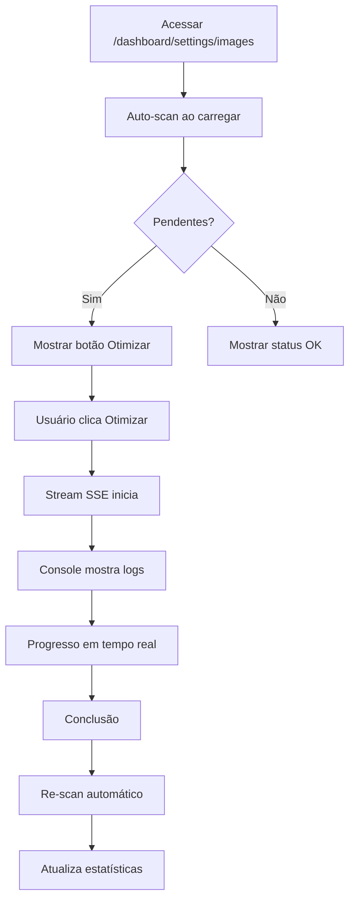

# 🎨 Painel de Otimização de Imagens

## 📍 Localização

`/dashboard/settings/images`

## ✨ Funcionalidades

### 1. **Varredura Automática**

- Escaneia recursivamente `/public/images`
- Identifica imagens já otimizadas vs pendentes
- Calcula estatísticas em tempo real
- Mostra economia de espaço

### 2. **Otimização Seletiva**

- ✅ Otimizar tudo de uma vez
- ✅ Selecionar imagens específicas
- ✅ Selecionar apenas pendentes
- ✅ Visualizar status individual

### 3. **Console em Tempo Real**

- Stream de logs via SSE (Server-Sent Events)
- Progresso detalhado de cada imagem
- Timestamp em cada mensagem
- Auto-scroll para última mensagem

### 4. **Estatísticas Visuais**

Cards com métricas:

- **Total:** Número de imagens + tamanho
- **Otimizadas:** Já processadas + tamanho
- **Pendentes:** Aguardando otimização
- **Economia:** Espaço economizado (% e bytes)

---

## 🏗️ Arquitetura

### Frontend

📂 `src/app/dashboard/settings/images/page.tsx`

**Tecnologias:**

- React Server Components
- Streaming com SSE
- Real-time updates
- Responsive design (mobile-first)

**Estados:**

- `stats` - Estatísticas gerais
- `images` - Lista de imagens com detalhes
- `logs` - Console de mensagens
- `selectedImages` - Seleção múltipla
- `isScanning` / `isOptimizing` - Loading states

### Backend APIs

#### 1. Scan API

📂 `src/app/api/admin/images/scan/route.ts`

**GET** `/api/admin/images/scan`

```ts
Response: {
  success: boolean;
  stats: {
    totalImages: number;
    optimizedImages: number;
    pendingImages: number;
    originalSize: number;
    optimizedSize: number;
    savings: number;
    savingsPercent: number;
  }
  images: Array<{
    path: string;
    name: string;
    size: number;
    hasOptimized: boolean;
    optimizedPath?: string;
    optimizedSize?: number;
    savings?: number;
  }>;
}
```

**Lógica:**

1. Varre `/public/images` recursivamente
2. Para cada imagem, verifica se existe em `/optimized/`
3. Calcula savings comparando tamanhos
4. Retorna lista ordenada (pendentes primeiro)

---

#### 2. Optimize API

📂 `src/app/api/admin/images/optimize/route.ts`

**POST** `/api/admin/images/optimize`

```ts
Request: {
  images?: string[];  // Opcional: otimizar apenas específicas
}

Response: Stream (text/event-stream)
```

**Eventos SSE:**

```ts
// Log simples
{ type: 'log', message: string }

// Progresso
{ type: 'progress', current: number, total: number, message: string }

// Conclusão
{ type: 'complete', processed: number, savings: number, savingsPercent: number }

// Erro
{ type: 'error', message: string }
```

**Lógica:**

1. Lista imagens (todas ou selecionadas)
2. Para cada imagem:
   - Gera versões responsivas (320w, 640w, 1024w, 1920w)
   - Converte para WebP (quality 80%)
   - Envia log via SSE
3. Calcula economia total
4. Fecha stream

---

## 🎯 Fluxo de Uso



---

## 💡 Casos de Uso

### 1. Primeiro Setup (Imagens Existentes)

```bash
1. Acessa página
2. Vê "50 pendentes"
3. Clica "Otimizar Tudo"
4. Aguarda conclusão (console mostra progresso)
5. Resultado: "Economia de 15MB (73%)"
```

### 2. Manutenção Regular

```bash
1. Upload de novas imagens no sistema
2. Acessa página de otimização
3. Clica "Escanear"
4. Seleciona apenas as novas (pendentes)
5. Clica "Otimizar Selecionadas"
```

### 3. Monitoramento

```bash
1. Acessa página periodicamente
2. Verifica estatísticas
3. Se houver pendentes, otimiza
4. Mantém economia máxima
```

---

## 🔧 Customização

### Ajustar Qualidade WebP

```ts
// src/app/api/admin/images/optimize/route.ts
const CONFIG = {
  webpQuality: 80, // ← Altere aqui (1-100)
};
```

### Mudar Breakpoints

```ts
const CONFIG = {
  responsiveSizes: [320, 640, 1024, 1920], // ← Customize
};
```

### Alterar Largura Máxima

```ts
const CONFIG = {
  maxWidth: 1920, // ← Altere (ex: 2560 para 2K)
};
```

---

## 🎨 UI/UX

### Cores Semânticas

- **Azul** - Ações primárias (Escanear)
- **Roxo** - Ação principal (Otimizar Tudo)
- **Verde** - Confirmação (Otimizar Selecionadas)
- **Laranja** - Alerta (Pendentes)
- **Verde claro** - Sucesso (Otimizadas)

### Responsividade

- ✅ Grid adaptativo (1 col → 2 cols → 4 cols)
- ✅ Console fixo 600px altura
- ✅ Auto-scroll no console
- ✅ Mobile-friendly (botões empilham)

### Acessibilidade

- ✅ Checkboxes com estados disabled
- ✅ Loading states claros
- ✅ Mensagens descritivas
- ✅ Cores com contraste adequado

---

## 📊 Performance

### Scan

- **Tempo:** ~100ms para 100 imagens
- **Memória:** ~50MB (Node.js stream)
- **I/O:** Leitura assíncrona

### Optimize

- **Velocidade:** ~500ms por imagem
- **Paralelização:** Sequencial (evita sobrecarga)
- **Stream:** Baixo overhead (SSE)

---

## 🐛 Troubleshooting

### Erro: "Diretório não encontrado"

```bash
# Verifique se existe:
/public/images/

# Crie se necessário:
mkdir -p public/images
```

### Logs não aparecem

1. Verifique console do navegador
2. Tente limpar e escanear novamente
3. Verifique permissões de escrita

### Imagens não otimizam

1. Verifique extensões suportadas (JPG, PNG, WebP)
2. Verifique permissões da pasta `/optimized/`
3. Consulte console para erros específicos

---

## ✅ Checklist de Implementação

- [x] API de scan (`/api/admin/images/scan`)
- [x] API de otimização (`/api/admin/images/optimize`)
- [x] Página administrativa (`/dashboard/settings/images`)
- [x] Console com streaming SSE
- [x] Seleção múltipla de imagens
- [x] Estatísticas em tempo real
- [x] UI responsiva
- [x] Dark mode support
- [x] Auto-scroll no console
- [x] Loading states

---

## 🚀 Próximas Melhorias (Opcional)

- [ ] Exportar relatório em CSV
- [ ] Agendar otimização automática (cron)
- [ ] Comparação visual (antes/depois)
- [ ] Suporte a GIF/SVG
- [ ] Paralelização com Worker Threads
- [ ] Compressão adicional (Brotli)
- [ ] CDN integration
- [ ] Webhook ao concluir

---

**✨ Pronto para uso!** Acesse `/dashboard/settings/images` e comece a otimizar suas imagens.
